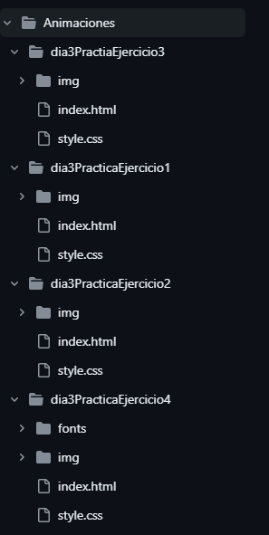
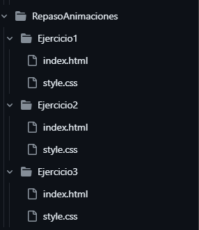
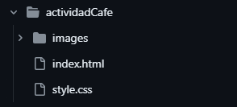
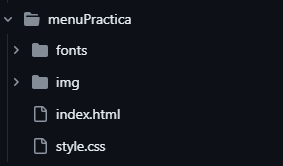

#  HTML Y CSS

En este repositorio encontrarás 4 carpetas que al abrirlas tendrán una división de trabajos con distintas temáticas. En cada una de estas carpetas podrás encontrar archivos HTML y CSS que al ejecutarlos tendrás una visualización de su función.

## División de Carpetas
|Carpetas|Número de Trabajos|
|--|--|
|Animaciones| 4 Trabajos|
|RepasoAnimaciones|3 Trabajos|
|ActividadCafe|1 Trabajo|
|menuPractica|1 Trabajo|

## Instalación 

1. Clona el repositorio: Utiliza el comando "git clone" seguido de la URL del repositorio para clonar el proyecto en tu computadora local.

2. Abre la carpeta del proyecto: Navega a la carpeta donde se clonó el proyecto y ábrela en tu editor de código favorito.

3. Abre el archivo HTML: Busca el archivo HTML principal (usualmente "index.html") y ábrelo con la extensión live server.

## Explicación 
*En la primera carpeta de la tabla* podrás encontrar 4 trabajos con la similitud de que son animaciones y cumplen con su repectivo archivo HTML y CSS, y una carpeta adicional para las imagenes y otra para contener el tipo de fuente utilizado.

*En la segunda carpeta de la tabla* encontrás otros archivos de animación, separados por 3 carpetas con su respectivo archivo HTML,CSS y una carpeta de imágenes y otra para fuentes.

*En la tercera carpeta de la tabla* Encontrarás la  página de una cafetería con su respectivo archivo HTML, CSS y otras carpetas para imágenes y las fuentes utilizadas.

*En la cuarta carpeta de la tabla* Encontrarás una página con un menú de canciones. Esta página fue hecha para practicar el menú y cuenta con sus respectivos archivos HTML, CSS y carpetas adicionales para las imágenes y el tipo de fuente.

